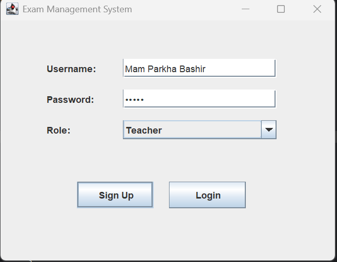
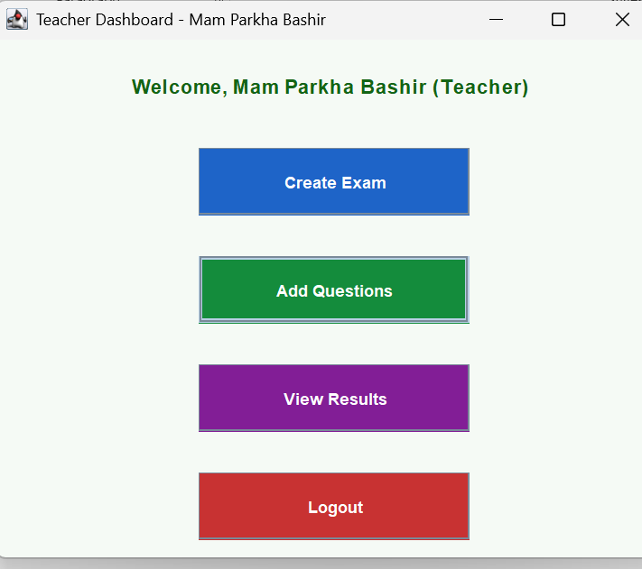
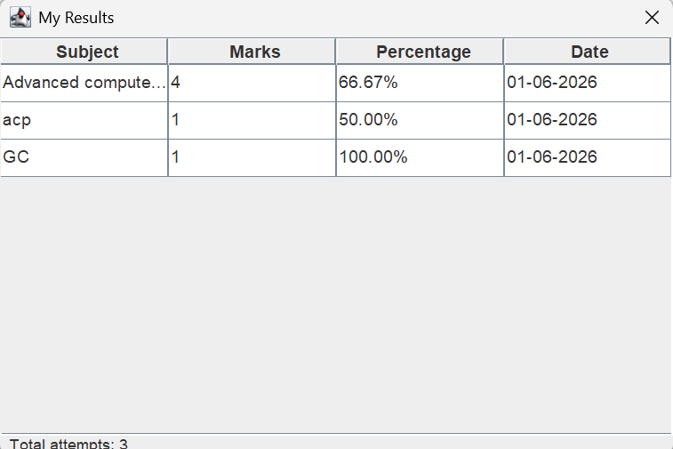

# 🎓 Exam Management System

A desktop-based **Exam Management System** developed using **Java Swing**, **JDBC**, and **MySQL**. The application provides an efficient and user-friendly platform for managing students, examinations, and results through separate dashboards for teachers and students.

This project was developed as a **semester project** to demonstrate object-oriented programming, database connectivity, file handling, and desktop application development in Java.

---

## 📌 Project Overview

The Exam Management System is designed to simplify the management of examination-related activities. It allows users to authenticate into the system, manage academic records, and securely store data using MySQL and file handling techniques.

The project follows Object-Oriented Programming (OOP) principles and integrates Java Swing for the graphical user interface with JDBC for database communication.

---

## ✨ Features

- 🔐 User Authentication (Login & Sign Up)
- 👨‍🏫 Teacher Dashboard
- 👨‍🎓 Student Dashboard
- 📝 Student Record Management
- 📊 Examination & Result Management
- 💾 MySQL Database Integration
- 🔗 JDBC Connectivity
- 📂 Text File Handling
- 📦 Binary File Handling
- 🖥️ Java Swing Graphical User Interface (GUI)
- 🧩 Object-Oriented Programming Concepts
- ⚡ Timer Thread Implementation

---

## 🛠️ Technologies Used

| Technology | Purpose |
|------------|---------|
| Java | Core Programming Language |
| Java Swing | GUI Development |
| JDBC | Database Connectivity |
| MySQL | Database Management |
| Eclipse IDE | Development Environment |
| Git | Version Control |
| GitHub | Project Hosting |

---

## 📁 Project Structure

```text
Exam-Management-System
│
├── src/
│   ├── examSystem/
│   │   ├── DBConnection.java
│   │   ├── FileHandler.java
│   │   ├── LoginSignupWindow.java
│   │   ├── StudentDashboard.java
│   │   ├── TeacherDashboard.java
│   │   └── TimerThread.java
│   │
│   └── module-info.java
│
├── database/
│   └── database.sql
│
├── screenshots/
│   ├── login.png
│   ├── student-dashboard.png
│   ├── teacher-dashboard.png
│   └── database.png
│
├── results.dat
├── results.txt
├── README.md
└── .gitignore
```

---

## 🗄️ Database Setup

1. Open **MySQL Workbench**.
2. Create a new database.
3. Import the `database/database.sql` file.
4. Open `DBConnection.java`.
5. Update the database credentials according to your MySQL configuration.
6. Save the changes.

---

## 🚀 Installation Guide

1. Clone this repository.

```bash
git clone https://github.com/raila-shaukat/Exam-Management-System.git
```

2. Open the project in **Eclipse IDE**.

3. Configure Java JDK.

4. Import the MySQL database using the provided SQL file.

5. Update database credentials inside `DBConnection.java`.

6. Run the application.

---

## 📸 Screenshots

### 🔐 Login Screen



---

### 👨‍🏫 Teacher Dashboard



---

### 👨‍🎓 Student Dashboard


---

### 🗄️ Database


---

### Result



## 🎯 Learning Outcomes

This project helped in understanding:

- Object-Oriented Programming (OOP)
- Java Swing GUI Development
- JDBC Database Connectivity
- MySQL Database Design
- File Handling (Text & Binary)
- Multi-threading using Timer Thread
- CRUD Operations
- Git & GitHub Version Control

---

## 🔮 Future Improvements

- Admin Dashboard
- Password Encryption
- Online Examination Module
- Attendance Management
- Email Notifications
- PDF Result Reports
- Search & Filter Improvements
- Better User Interface Design

---

## 👩‍💻 Author

**Raila Shaukat**

BS Information Technology Student

GitHub: https://github.com/raila-shaukat

---

## ⭐ Support

If you found this project helpful, consider giving it a ⭐ on GitHub.
